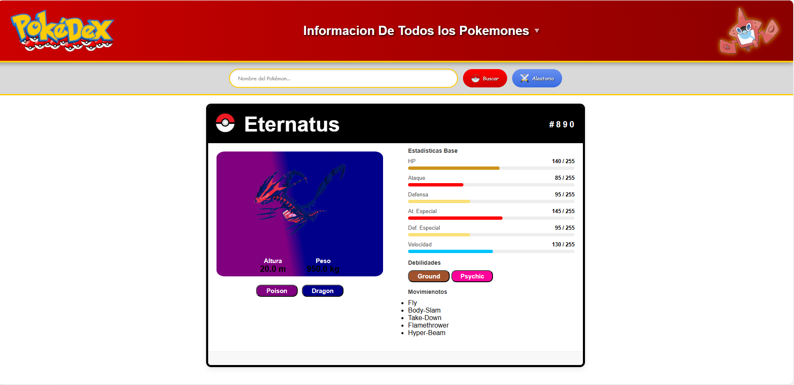

# 🧩 Proyecto: POKEDEX

Este proyecto consiste en la creación de una **Pokedex interactiva** desarrollada con **HTML, CSS y JavaScript**, donde se implementa una **conexión en tiempo real con la PokeAPI** utilizando la librería **Axios**.



---

## 🎮 Descripción del Proyecto

La Pokedex permite **buscar información de Pokémon por nombre o ID**, mostrando datos e imágenes obtenidas directamente desde la **PokeAPI (https://pokeapi.co)**.  
Fue creada como ejercicio práctico para fortalecer el uso de **JavaScript moderno**, **llamadas a APIs** y el **manejo dinámico del DOM**.

🌐 **Sitio desplegado:** 
 https://juanmacode2025.github.io/POKEDEX/

---

## ⚙️ Tecnologías Utilizadas

- **HTML5** → Estructura semántica de la aplicación.  
- **CSS3** → Estilos visuales, colores y disposición de elementos.  
- **JavaScript (ES6)** → Lógica principal de búsqueda y conexión con la API.  
- **Axios** → Librería para realizar peticiones HTTP asíncronas a la API.  
- **PokeAPI** → Fuente de datos de los Pokémon.

---

## 🔗 Conexión con la API

Se utilizó **Axios** para realizar la consulta de datos a la API:

```js
const res = await axios.get(`https://pokeapi.co/api/v2/pokemon/${idONombre}`);
console.log(res);
```
Con esta instrucción, se obtiene la información del Pokémon solicitado, incluyendo:

      Nombre - Imagen - Tipo - Habilidades - Estadísticas

 ## 🖼️ Estructura del Proyecto

POKEDEX/
│
├── index.html       # Página principal del proyecto
├── pokedex.css      # Estilos del diseño de la Pokedex
├── pokede.js        # Lógica principal con conexión a la PokeAPI
├── Poke_ball.png    # Imagen decorativa
├── rotomdex.png     # Imagen de referencia adicional
└── README.md        # Documentación del proyecto


## 📱 Características Principales
   ✅ Interfaz visual inspirada en una Pokedex clásica.
   ✅ Búsqueda de Pokémon por nombre o número ID.
   ✅ Información dinámica obtenida desde la PokeAPI.
   ✅ Diseño limpio, colorido y responsivo.
   ✅ Práctica real de fetch de datos con Axios y manipulación del DOM.

## 💡 Aprendizajes Clave
Conexión a APIs REST usando Axios y async/await.
Manejo de eventos e interacción del usuario en JavaScript.
Uso de CSS para maquetar interfaces inspiradas en videojuegos.
Integración completa entre HTML, CSS y JS en un solo proyecto.

## 👨‍💻 Autor
Juan Manuel Mejía Duarte
👾 Desarrollador Web en formación
    **@JuanmaCode2025**  
    5 Junio de 2025

✨ Este proyecto muestra la conexión entre el diseño web y la lógica de programación, dando vida a una Pokedex funcional y dinámica con datos reales de la PokeAPI.

---
