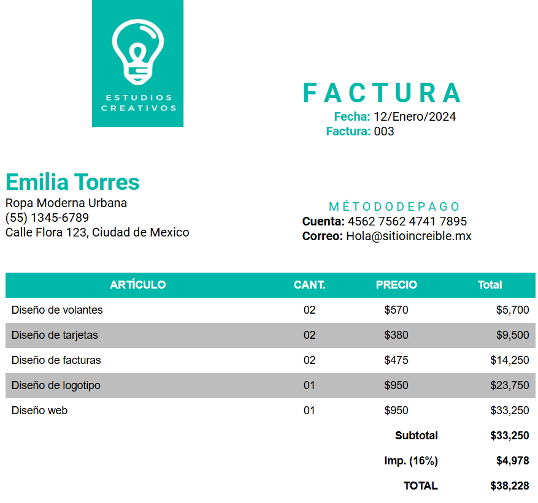

# 🧾 Proyecto: Maquetación de Factura

Este proyecto consiste en la **maquetación completa de una factura** utilizando únicamente **HTML y CSS**.  
Fue desarrollado como ejercicio práctico para fortalecer el uso correcto de **tablas**, estructura semántica y estilos aplicados a documentos simulados.

---

## 📄 Descripción General

El objetivo principal de esta actividad fue **practicar la construcción de tablas en HTML**, organizando la información de forma clara, ordenada y profesional.  
Además, se aplicaron estilos en **CSS** para mejorar la presentación visual y aprender el uso de elementos básicos como:

- Bordes  
- Sombras  
- Alineación  
- Espaciado  
- Composición de columnas y filas  

Esta factura simula un documento real con su estructura típica:

- Encabezado  
- Información del cliente  
- Tabla de productos  
- Totales  
- Observaciones o notas finales  

---

## 🛠️ Tecnologías Utilizadas

- **HTML5** → Maquetación del contenido y estructura de la factura.  
- **CSS3** → Estilos, bordes, diseño de tabla y formato visual.  

No se utilizó JavaScript ya que el enfoque del ejercicio era enseñar **maquetación y organización de datos** en tablas.

---

## 📂 Estructura del Proyecto

Factura/
│
├── Captura de pantalla.png # Imagen del resultado final
├── Factura.html # Archivo principal con la maquetación
└── Readme.md # Documentación del proyecto

## 📚 Aprendizajes del Proyecto

Durante este trabajo se reforzaron conocimientos en:

- Uso correcto de **<table>**, **<thead>**, **<tbody>**, **<tr>**, **<th>** y **<td>**.  
- Separación de contenido (HTML) y estilos (CSS).  
- Organización visual mediante:
  - Bordes finos y dobles  
  - Espaciado interno (padding)  
  - Alineación de texto  
  - Estilos alternos para filas  
- Construcción de un documento con aspecto **profesional y limpio**.

---

## 🎯 Objetivo del Ejercicio

Comprender cómo funcionan las **tablas en HTML**  
y cómo pueden utilizarse para representar documentos formales como facturas, recibos o listados, aplicando estilos que mejoran su presentación.

---

## 👤 Autor

**Juan Manuel Mejía Duarte**  
**@JuanmaCode2025**  
📘 Proyecto de práctica en HTML y CSS  
📅 Año: 2024  
