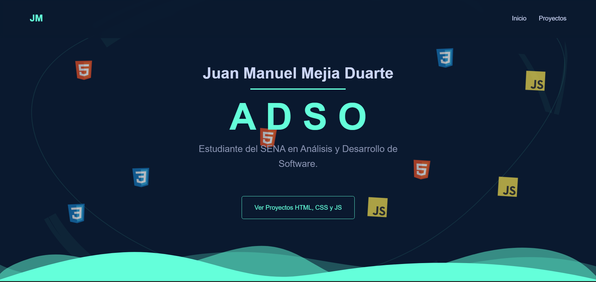
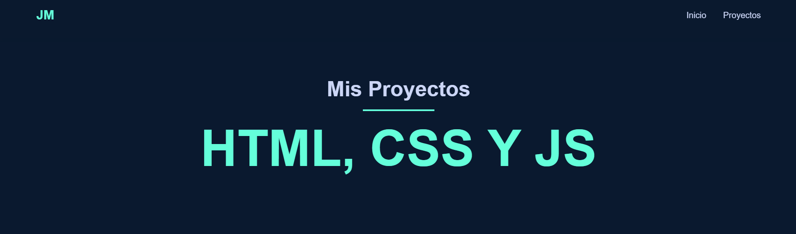

# 💻 Portafolio de Proyectos: HTML, CSS y JavaScript

Bienvenido a mi repositorio personal de práctica y aprendizaje en **desarrollo web frontend**.  
Aquí encontrarás **todos mis proyectos realizados con HTML, CSS y JavaScript**, organizados cuidadosamente por carpetas según su nivel y temática.

🌐 **Sitio desplegado en GitHub Pages:**  
👉 [Ver Portafolio en línea](https://juanmacode2025.github.io/PORTAFOLIO-DE-HTML-CSS-Y-JS/)

---

## 🗂️ Organización del Repositorio

El repositorio está dividido en dos secciones principales, para mantener todos los trabajos de manera **ordenada y clara**:

### 🧩 **1. HTML - CSS**
Contiene mis primeros proyectos centrados en la **estructura, maquetación y estilos visuales con CSS**.  
Cada carpeta representa un proyecto individual con su propio `README.md`.

#### 📁 Carpetas incluidas:
- **Hoja-de-Vida** → Proyecto de hoja de vida digital con diseño responsivo.  
- **My_Diario** → Proyecto básico de maquetación sin uso de Grid ni Flexbox.  
- **My-viaje** → Práctica intermedia de maquetación con Flexbox y Grid.  
- **Tienda-de-Accesorios** → Proyecto final de maquetación estática con catálogo de productos.  

---

### ⚙️ **2. HTML, CSS y JS**
Aquí se encuentran los proyectos donde se integran **HTML, CSS y JavaScript** para agregar interactividad y lógica al frontend.

#### 📁 Carpetas incluidas:
- **Agendador-de-Citas** → Proyecto con formulario interactivo, manejo del DOM y almacenamiento local.  

Además, esta sección contiene archivos base del sitio:
- `index.html` → Página principal del portafolio.  
- `proyectos.html` → Listado general de proyectos.  
- `LICENSE` → Licencia del repositorio.  

---

## 🎨 Tecnologías Utilizadas

- **HTML5** → Estructura semántica y accesible.  
- **CSS3 (Flexbox y Grid)** → Diseño adaptable y moderno.  
- **JavaScript (ES6)** → Interactividad, validaciones y almacenamiento local.  
- **Librerías externas:**  
  - *SweetAlert2* para alertas personalizadas.  

---

## 📘 Propósito del Repositorio

Este repositorio fue creado como **bitácora de aprendizaje personal**, donde documento mi progreso como desarrollador frontend.  
Cada carpeta representa una etapa distinta del proceso, desde la maquetación estática hasta la programación interactiva.

---

## 👨‍💻 Autor

**Juan Manuel Mejía Duarte**  
**@JuanmaCode2025**  
📅 *2025*  

> ✨ Este portafolio muestra mi evolución como desarrollador frontend, aplicando buenas prácticas, estructura limpia y diseño responsivo.
>  
> 🚀 Disponible en línea en GitHub Pages:  
> [https://juanmacode2025.github.io/PORTAFOLIO-DE-HTML-CSS-Y-JS/](https://juanmacode2025.github.io/PORTAFOLIO-DE-HTML-CSS-Y-JS/)

